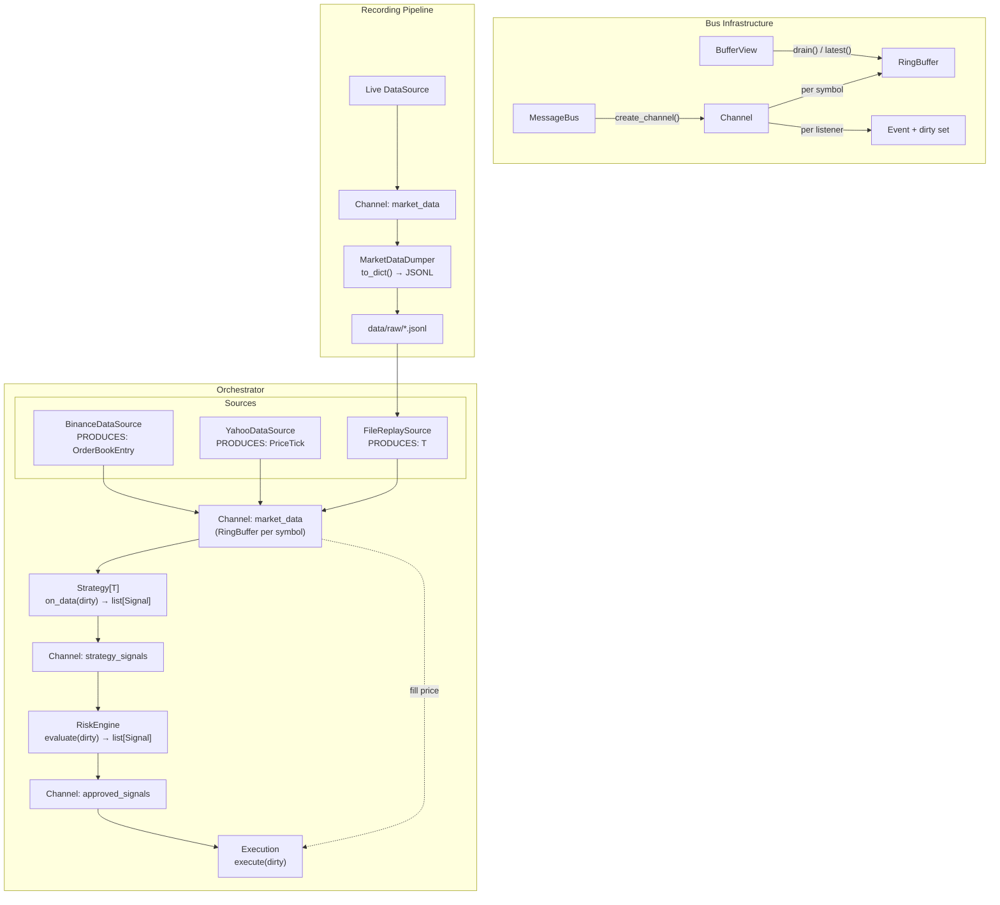

# Quantitative Trading System

A modular pipeline for quantitative trading research and execution, built in Python. The focus of this project is the infrastructure: a type-safe, component-based system where new data sources, strategies, and execution modes integrate without modifying the core. Components communicate through typed dataclasses over a shared message bus, and the pipeline is generic over the market data type — compatibility between sources and strategies is enforced at startup.

This is my first ground-up quantitative trading project. The priority has been building a system that is well-structured, encapsulated, and extensible before layering on strategy complexity.

## Architecture



Each named channel is an independent publish/subscribe unit with its own ring buffers, listener pool, and dirty sets. Publishing on one channel never wakes listeners on another. Strategies and execution run on their own threads; the data source drives the pipeline from the main thread via `asyncio`.

### Orchestrators

Three orchestrators wire the pipeline for different use cases:

- **BacktestOrchestrator** — runs a `BacktestDataSource` to completion with paced replay (one tick at a time, no buffer overflow). Records market history for post-run analysis. Returns `list[TradeRecord]`.
- **LiveOrchestrator** — runs a live data source indefinitely until externally stopped.
- **RecordingOrchestrator** — wires a live source to a `MarketDataDumper` for data collection. No strategy, risk, or execution.

All component wiring is YAML-driven. Each component block has a `type` (string → class lookup via registry) and `params` (unpacked into the constructor). Adding a new component is one import and one dict entry in `src/registry.py`.

## Project Structure

```
├── config/                         # YAML run configurations
├── docs/
│   ├── math/                       # LaTeX derivations (Kalman, OU, Bertram)
│   └── design/                     # Architecture and design decision docs
├── data/
│   ├── raw/                        # Immutable original data and JSONL recordings
│   └── processed/                  # Derived datasets
├── notebooks/                      # Exploratory analysis and demos
├── src/
│   ├── types.py                    # Shared dataclasses (OrderBookEntry, PriceTick, Signal, TradeRecord)
│   ├── registry.py                 # Class registries for orchestrator resolution
│   ├── bus/                        # RingBuffer, Channel, MessageBus, BufferView
│   ├── data/                       # Data source ABCs and implementations
│   ├── strategy/                   # Strategy ABC and implementations
│   ├── risk/                       # Risk engine ABC and implementations
│   ├── execution/                  # Execution ABC and implementations
│   └── orchestrator/               # Pipeline wiring and lifecycle management
├── tests/                          # pytest test suite
├── scripts/                        # Entry point scripts
└── Personal/                       # Sandbox notebooks (gitignored)
```

## Usage

```python
import yaml
from src.orchestrator import BacktestOrchestrator

config = yaml.safe_load(open("config/backtest_random.yaml"))
orchestrator = BacktestOrchestrator(config)
trade_log = orchestrator.run()
```

## Setup

```bash
make install   # Create venv and install dependencies
make run       # Activate the venv
make clean     # Remove the venv
```

## Future Development

The infrastructure is in place. What comes next is the strategy layer:

- **Kalman Filter** — Dynamic hedge ratio estimation via recursive state-space filtering
- **Ornstein-Uhlenbeck Process** — Mean-reversion parameter estimation (θ, μ, σ)
- **Bertram Optimal Thresholds** — Analytically derived entry/exit levels maximising expected return per unit time
- **RSI** — Relative Strength Index on VWMP with incremental computation

Mathematical derivations for the stat arb components are documented in `docs/math/`.

## Standards

See [STANDARDS.md](STANDARDS.md) for coding conventions, naming rules, and documentation requirements.