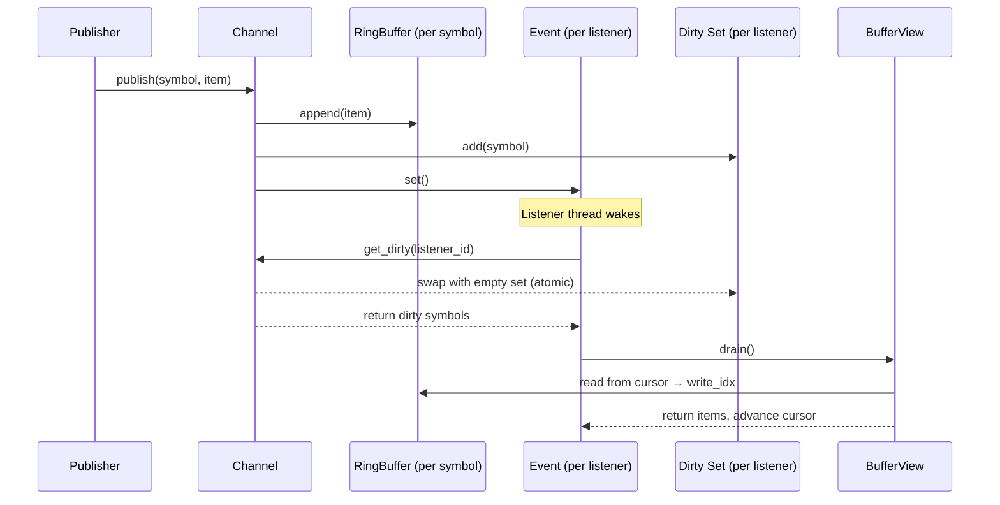
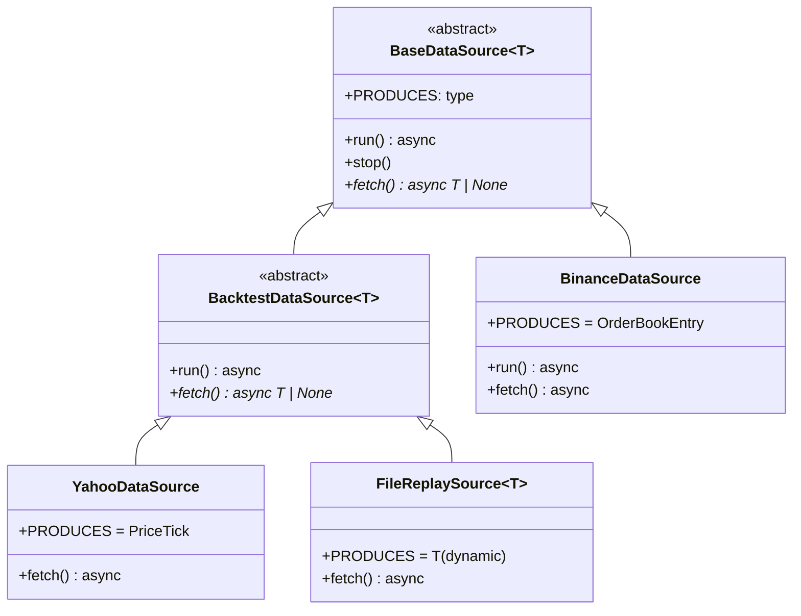
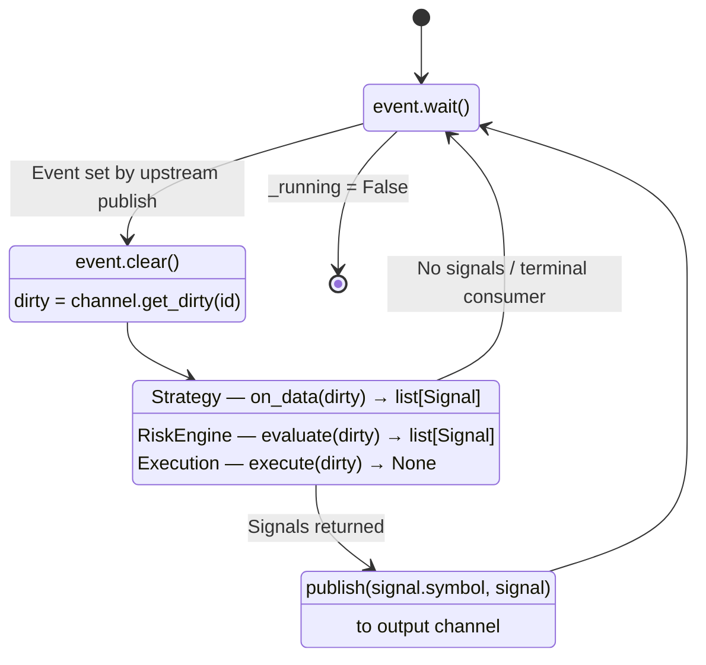
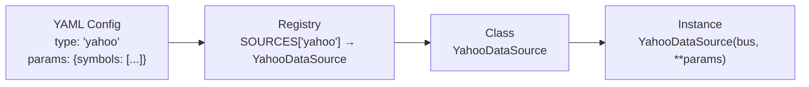
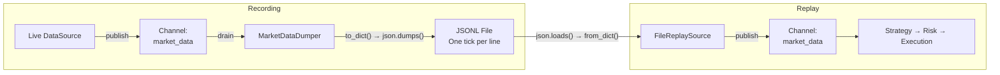

# System Architecture

Detailed technical documentation of the Quantitative Trading System internals. For a high-level overview, see the [README](../README.md).

---

## 1. Bus Infrastructure

All inter-component communication flows through the bus. Components never reference each other directly — they publish to and read from named channels. This decouples the pipeline stages and makes it possible to swap any component without touching the others.

### Components

**MessageBus** is a thin registry of named `Channel` instances. It exposes `create_channel(name, capacity)` and `channel(name)`. No routing logic — it only stores and hands out references.

**Channel[T]** is a single publish/subscribe unit. Each channel holds one `RingBuffer` per symbol, one `threading.Event` per listener, and one dirty set per listener. Channels are fully isolated — publishing on one channel never wakes listeners on another.

**RingBuffer[T]** is a fixed-capacity, pre-allocated circular buffer. Single writer, multiple readers. When the buffer is full, the oldest item is silently overwritten. Indexing uses the absolute write-sequence position, not the physical slot, so reader arithmetic stays simple.

**BufferView[T]** is a stateful reader over a `RingBuffer`. It tracks a private read cursor and supports three patterns: `latest()` peeks at the most recent item without moving the cursor, `last_n(n)` returns a sliding window, and `drain()` consumes everything since the last drain and advances the cursor. If the writer laps the reader, `gap_detected` is set on the next drain and the cursor snaps forward to the oldest surviving item.

### Publish / Subscribe Cycle



### Key Design Decisions

**Per-symbol buffers.** Each symbol gets its own `RingBuffer` within a channel. A high-frequency symbol cannot overflow into a low-frequency symbol's buffer space.

**Dirty set swap.** `get_dirty()` replaces the listener's dirty set with an empty set in a single reference swap. Under CPython's GIL this is atomic — no locks required.

**Lazy buffer creation.** Buffers are created on first `publish()` or `get_buffer()` for a symbol. Consumers can register before any data arrives.

---

## 2. Data Sources

Data sources are the entry point of the pipeline. They produce typed market data and publish it to the `market_data` channel. The type system splits into two hierarchies depending on whether the source is live or historical.

### Class Hierarchy



### Live vs Backtest

**Live sources** inherit from `BaseDataSource` directly. `run()` loops `await fetch()` and publishes as fast as the exchange delivers. If the strategy falls behind, the ring buffer absorbs the overflow — the strategy works on the freshest available data.

**Backtest sources** inherit from `BacktestDataSource`, which overrides `run()` with a paced loop. Before publishing each tick, it calls `channel.all_listeners_clear()` and yields until every downstream consumer has processed the previous tick. This guarantees no buffer overflow and ensures `SimulationExecution` fills at a realistic price — "next tick" in the buffer is genuinely the next tick in market time.

### PRODUCES Contract

Every data source declares a `PRODUCES` class attribute (e.g. `PRODUCES = PriceTick`). The orchestrator checks `source.PRODUCES == strategy.CONSUMES` at startup before any tick is processed. `FileReplaySource` is the exception — its `PRODUCES` is set dynamically in `__init__` based on the `data_cls` parameter, because it's generic over the data type.

---

## 3. Pipeline Components

Strategy, risk engine, and execution share the same event-driven run loop pattern. Each registers as a listener on its input channel, sleeps until woken by an `Event`, reads its dirty set, processes, and (except execution) publishes to its output channel.

### Shared Run Loop



### BaseStrategy[T]

Generic over the market data type `T`. Declares `CONSUMES: type` to match against the source's `PRODUCES`. The concrete subclass implements `on_data(dirty: set[str]) -> list[Signal]`, which reads market data through its own `BufferView` instances and returns trading signals. The ABC handles the event loop, dirty set retrieval, and signal publishing.

### BaseRiskEngine

Sits between strategy and execution. Same run loop — listens on `strategy_signals`, publishes to `approved_signals`. The concrete subclass implements `evaluate(dirty) -> list[Signal]`. Can pass signals through, modify them, or veto by returning an empty list. Because listen and publish channels are independent `Channel` instances, publishing to `approved_signals` never wakes the risk engine's own listener — the infinite-loop problem is structurally impossible.

### BaseExecution

Terminal consumer — listens on `approved_signals`, never publishes. The concrete subclass implements `execute(dirty) -> None`. `SimulationExecution` reads the current market price from the `market_data` channel via a separate `BufferView` using `latest()`, calls `fill_price(side)` on the market data entry (polymorphic across `PriceTick` and `OrderBookEntry`), and records a `TradeRecord`.

---

## 4. Orchestrators

Orchestrators read a YAML config, resolve component classes from a registry, validate type compatibility, wire everything to the bus, manage thread lifecycles, and define the run/shutdown sequence. They are the only place where concrete classes are referenced — everything else works through ABCs and channel names.

### Config Resolution



The registry (`src/registry.py`) holds flat dicts mapping config strings to classes: `SOURCES`, `STRATEGIES`, `RISK_ENGINES`, `EXECUTORS`, `DATA_TYPES`. Adding a new component is one import and one dict entry.

After resolution, the orchestrator checks `source_cls.PRODUCES == strategy_cls.CONSUMES`. If this fails, a `TypeError` is raised before any tick is processed.

### Orchestrator Variants

**BaseOrchestrator** owns everything shared: bus creation, three-channel topology (`market_data` → `strategy_signals` → `approved_signals`), class resolution, type validation, thread start (`_start_consumers`), and shutdown ordering (`_shutdown`). Does not define `run()`.

**BacktestOrchestrator** extends the base with a type guard (`isinstance(source, BacktestDataSource)`), a market data recorder thread that drains ticks into `market_history`, and a `run()` that blocks until the data source is exhausted. Returns `list[TradeRecord]`.

**LiveOrchestrator** adds only `run()`. Starts consumer threads, blocks on `asyncio.run(source.run())`, shuts down when the source stops.

**RecordingOrchestrator** is standalone — does not inherit from `BaseOrchestrator` because it skips strategy, risk, and execution entirely. Wires a live source to a `MarketDataDumper` on a single `market_data` channel.

### Shutdown Ordering

Components are stopped front-to-back. Each `stop()` sets `_running = False` and calls `event.set()` to unblock any sleeping `wait()`. No sentinel values through the bus.

```
source.stop() → strategy.stop() → risk.stop() → execution.stop()
```

Threads are joined after all components are stopped.

---

## 5. Data Recording & Replay

The recording and replay system allows live market data to be captured to disk and deterministically replayed through the pipeline for backtesting.

### Round-Trip Flow



### Serialisation

Each data contract (`PriceTick`, `OrderBookEntry`) implements `to_dict()` and a `from_dict()` classmethod. `to_dict()` returns a plain dict with only data fields — `_validate` is excluded. `from_dict()` reconstructs the dataclass with validation enabled by default. `OrderBookEntry.from_dict()` converts JSON lists back to tuples of tuples for bids/asks.

### MarketDataDumper

A standalone bus listener — not a pipeline component. Registers on the `market_data` channel, drains ticks via `BufferView` with `from_start=True`, and writes one `json.dumps(tick.to_dict())` per line. Type-agnostic: works with any dataclass that implements `to_dict()`.

### FileReplaySource

A generic `BacktestDataSource[T]` that reads a JSONL file line-by-line. Parameterised by `data_cls` at construction — the class to call `from_dict()` on. `PRODUCES` is set dynamically to match `data_cls`. Loads all lines upfront for deterministic replay. Pacing is inherited from `BacktestDataSource`.

### RecordingOrchestrator

Wires a live source to the dumper with a single `market_data` channel. Config specifies the source type and output filepath. `run()` starts the dumper on a thread, blocks on the source, then shuts down both.